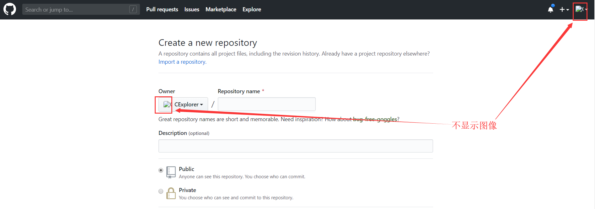

# Git与GitHub入门实践

> 学习实验楼的git教程以及个人GitHub Page网站搭建
>
> 学习网址：https://www.shiyanlou.com/courses/1035

[TOC]

## 实验1 Git与GitHub简介

### 一、Git与GitHub的来历

​		Linux 之父 Linus 在 1991 年创建开源的 Linux 操作系统之后，多年来依靠全世界广大热心志愿者的共同建设，经过长足发展，现已成为世界上最大的服务器系统。系统创建之初，代码贡献者将源码文件发送给 Linus，由其手动合并。这种方式维持多年后，代码量已经庞大到人工合并难以为继，于是深恶集中式版本控制系统的 Linus 选择了一个分布式商业版本控制系统 BitKeeper，不过 Linux 社区的建设者们可以免费使用它。BitKeeper 改变了 Linus 对版本控制的认识，同时 Linus 发现 BitKeeper 有一些不足，而且有个关键性的问题使之不能被广泛使用，就是不开源。

​		在 2005 年，BitKeeper 所在公司发现 Linux 社区有人企图破解它，BitKeeper 决定收回 Linux 社区的免费使用权。Linus 对此事调节数周无果，找遍了当时已知的各种版本控制系统，没有一个看上眼的，一怒之下决定自己搞一个。Linus 花了十天时间用 C 语言写好了一个开源的版本控制系统，就是著名的 Git。

​		2007 年旧金山三个年轻人觉得 Git 是个好东西，就搞了一个公司名字叫 GitHub，第二年上线了使用 Ruby 编写的同名网站 GitHub，这是一个基于 Git 的免费代码托管网站（有付费服务）。十年间，该网站迅速蹿红，击败了实力雄厚的 Google Code，成为全世界最受欢迎的代码托管网站。2018 年 6 月，GitHub 被财大气粗的 Microsoft 收购。2019 年 1 月 GitHub 宣布用户可以免费创建私有仓库。根据 2018 年 10 月的 GitHub 年度报告显示，目前有 3100 万开发者创建了 9600 万个项目仓库，有 210 万企业入驻。

### 二、在 GitHub 上创建仓库

​		网上搜索[GitHub](https://github.com/)，并完成注册,登录

​		如果出现GitHub网站图像不显示的情况，如下图：



​		Windows环境下解决方案：打开自己电脑路径C:\Windows\System32\drivers\etc下的hosts文件，因为权限可以使用notepad++，vscode等编辑器打开，在后面加上下面这些代码：

```bash
# GitHub Start 
192.30.253.112    github.com 
192.30.253.119    gist.github.com
151.101.184.133    assets-cdn.github.com
151.101.184.133    raw.githubusercontent.com
151.101.184.133    gist.githubusercontent.com
151.101.184.133    cloud.githubusercontent.com
151.101.184.133    camo.githubusercontent.com
151.101.184.133    avatars0.githubusercontent.com
151.101.184.133    avatars1.githubusercontent.com
151.101.184.133    avatars2.githubusercontent.com
151.101.184.133    avatars3.githubusercontent.com
151.101.184.133    avatars4.githubusercontent.com
151.101.184.133    avatars5.githubusercontent.com
151.101.184.133    avatars6.githubusercontent.com
151.101.184.133    avatars7.githubusercontent.com
151.101.184.133    avatars8.githubusercontent.com
 
 # GitHub End
```

​		保存后刷新即可观察到图像。

​		新建代码仓库，如果是普通仓库符合GitHub要求的起名即可，如果是GitHub主页，需要符合下面的命名要求：`xxx.github.io`，xxx自己起名字。

​		


