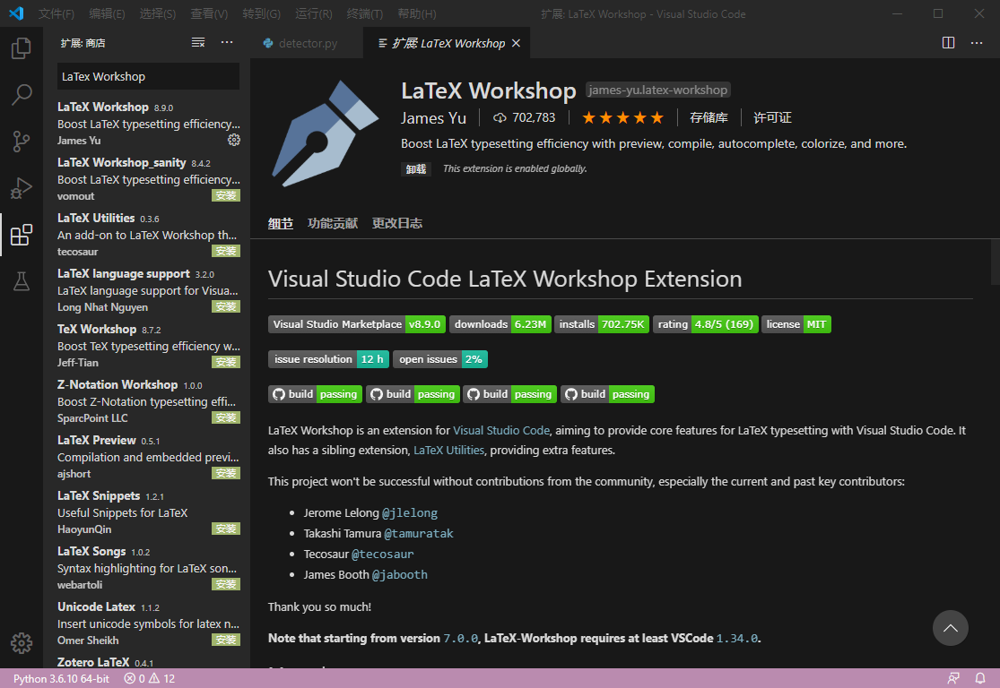

# VS code配置LaTex

## 前言

最近要投稿elsiver旗下的期刊《Computers and Electronics in Agriculture》，投稿只能用latex模板，而以前的texlive和tex studio已经被我删除了，还需要下载很大的文件，而`VSCode`已完美兼容latex，本文记录了latex的一些配置流程

## 配置扩展

打开VSCode，搜索LaTex Workshop，安装。如图：

